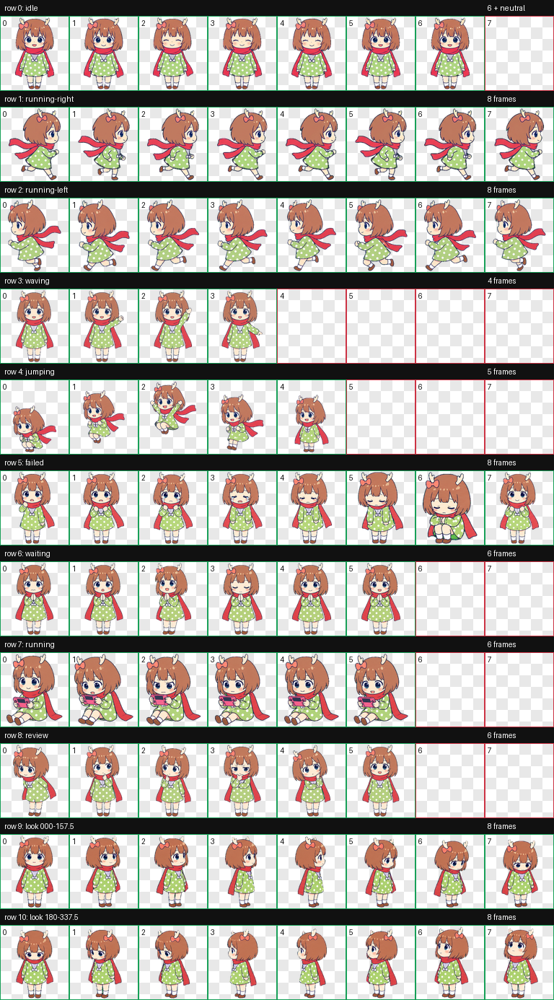
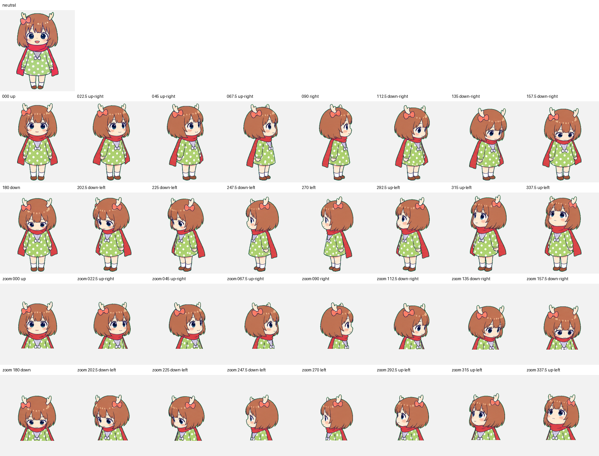

# 鹿乃 Codex 宠物

## 项目介绍

这是一个以唱见鹿乃的Q版形象为原型制作的非官方 Codex Pet v2。

本项目由全部由Codex进行生成。

## 预览

已确认的图集预览、方向检查和动画预览位于 `assets/`。

### 角色立绘

<p align="center">
  
</p>

### 动作总览



### 16 向观察



## 安装

可安装文件位于 `dist/`。将 `pet.json` 和 `spritesheet.webp` 复制到：

```text
%USERPROFILE%\.codex\pets\kano--scarbal486\
```

然后刷新或重启 Codex，在 Settings -> Pets 中选择 `鹿乃 / Kano`。


## 包内容

运行时只需要以下文件：

- `dist/pet.json`
- `dist/spritesheet.webp`

`dist/validation.json` 记录确定性图集验证结果，运行时不需要此文件。

## 开发说明

本宠物使用 Codex Pet v2 规格：图集为 8 x 11，每个单元格为 192 x 208，最终尺寸为 1536 x 2288。

## 素材来源与权利说明

详见 `docs/sources-and-rights.md` 和 `NOTICE.md`。原始贴纸参考仅保存在本地，不随本仓库分发。

## 非官方项目

本项目与鹿乃本人、其管理团队、OpenAI，以及参考表情包的创作者和发行方均无关联，也未获得上述各方背书。请勿用于任何营利行为，如有侵权请联系本人删除该项目。
